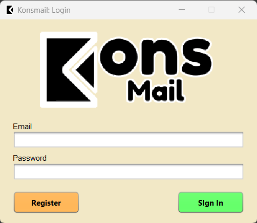
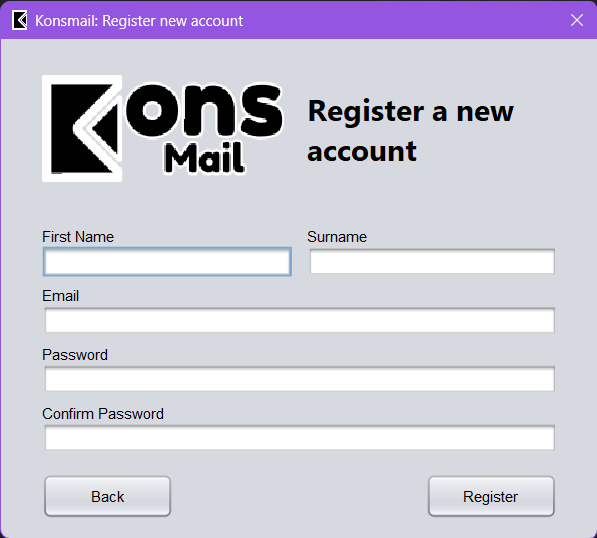
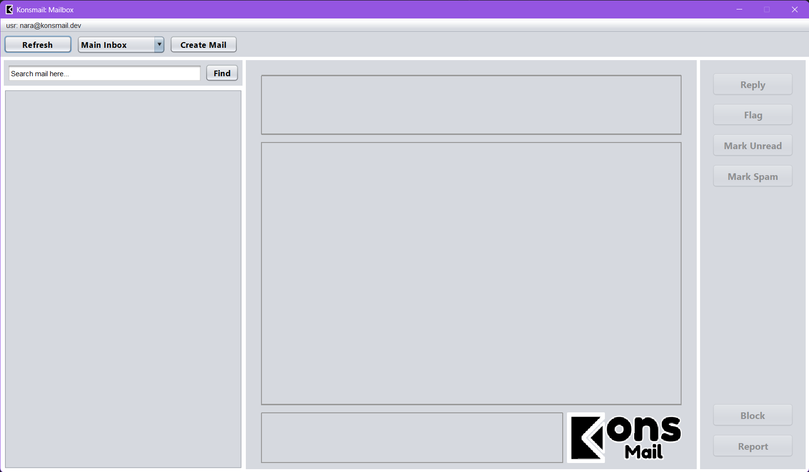
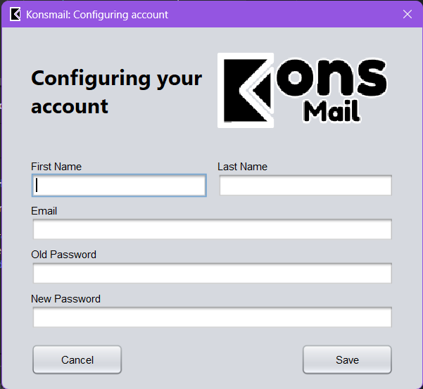
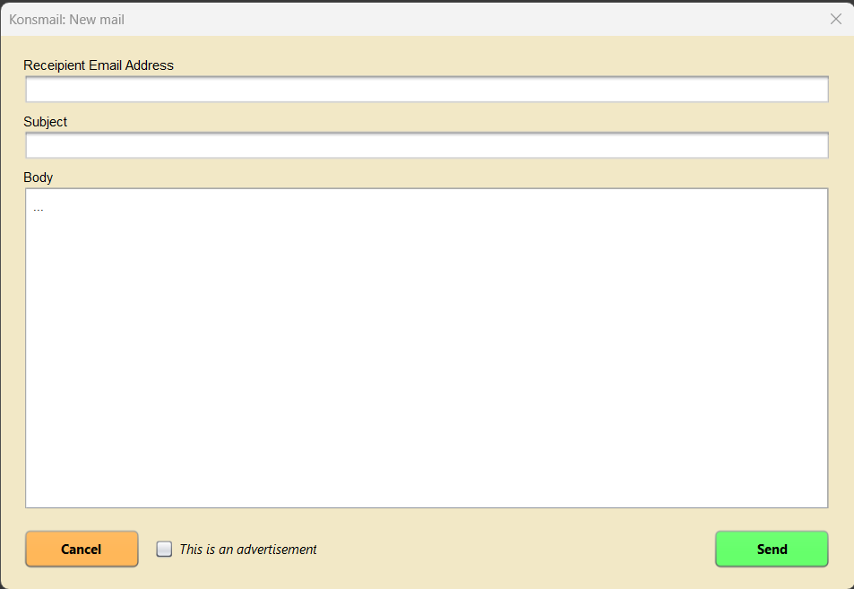

# Konsmail (Mailing App)

## What is Konsmail?

This is a simple mailing app that allows you to send emails to multiple recipients at once. It is built using Java.
The app is built for the purpose of final project of the course "Object-Oriented Programming 2". The database structure
is stored locally using an Oracle database.

## Project Structure

```
src
└── main                    
    ├── database            # Contains database files
    ├── java
    │   ├── archives        # Contains unused files
    │   ├── backend         # Contains backend files
    │   ├── gui             # Contains GUI files
    │   ├── models          # Contains models/objects used in the app
    │   ├── utils           # Contains utility files
    │   └── Konsmail.java
    └── resources           # Contains resources used in the app (images, icons, etc.)
```

## GUI Preview

The main window is not resizable, the resolution is fixed at 1366x768.

### Login Page

<div style="text-align: center">
  
</div>

### Registration Page

<div style="text-align: center">
  
</div>

### Mailbox Page

<div style="text-align: center">
  
</div>

### Configure Account Page

<div style="text-align: center">
  
</div>

### New Mail Page

<div style="text-align: center">
  
</div>

## Contributors

These are the people who contributed to the project:

| Nr | Name                                    | NIM  |
|----|-----------------------------------------|------|
| 1  | [Nara](https://github.com/vianneynara)  | -091 |
| 2  | [Edward](https://github.com/Trustacean) | -067 |
| 3  | [Patrick](https://github.com/FatDog98)  | -078 |
